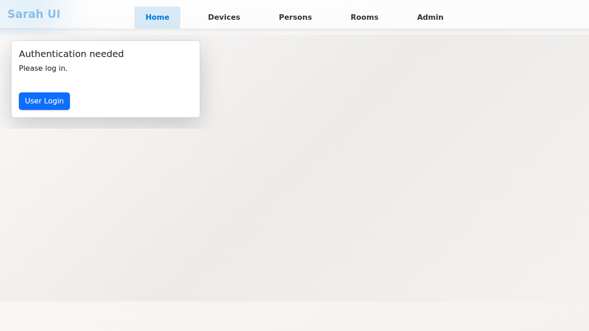
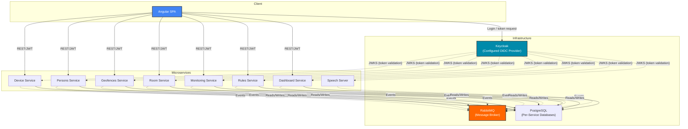

# Sarah – Smart Home Management System

> A modern smart home platform built with .NET 10 microservices and Angular 18.



## Features

✨ **Device Management** – Centralised control for lights, sensors, switches, and other IoT devices  
🏠 **Room Management** – Organise devices by room and location  
📍 **Geofencing** – Location-based automation and presence detection  
🤖 **Automation Rules** – Flexible condition-based rule engine (if-then-else) with email notifications  
📊 **Monitoring** – Weather data, system health tracking, and metrics  
🎤 **Voice Control** – Speech recognition and text-to-speech  
⚡ **Event-Driven** – Asynchronous communication via RabbitMQ topic exchanges  
🔐 **Authentication** – OAuth2/OIDC via Keycloak (configured OIDC provider)

## Component Diagram



## Getting Started

Run Sarah with .NET Aspire – no manual configuration required:

```bash
git clone https://github.com/fondencn/sarah.git
cd sarah
dotnet run --project Sarah.AppHost
```

See **[docs/aspire-setup.md](docs/aspire-setup.md)** for the full setup guide including credentials, access URLs, and troubleshooting.

## Documentation

- **[Service Reference](docs/services.md)** – Details on every microservice: responsibilities, endpoints, databases, and dependencies
- **[Aspire Setup Guide](docs/aspire-setup.md)** – Full guide for running Sarah with .NET Aspire
- **[Deployment Guide](docs/deployment.md)** – Raspberry Pi deployment workflow, current deployed state, and speaker-specific operational notes
- **[AppHost README](Sarah.AppHost/README.md)** – AppHost configuration reference

For the currently deployed Raspberry Pi setup, including the temporary `speaker3` voice-recognition workaround, start with the `Current Deployed State` section in [docs/deployment.md](docs/deployment.md).

## Contributing

1. Fork the repository and create a feature branch
2. Make your changes with clear, descriptive commits
3. Ensure tests pass: `dotnet test && cd sarah.client && npm test`
4. Format code: `dotnet format && cd sarah.client && npm run lint`
5. Submit a pull request with a clear description

## License

MIT License – see [LICENSE](LICENSE) for details.
