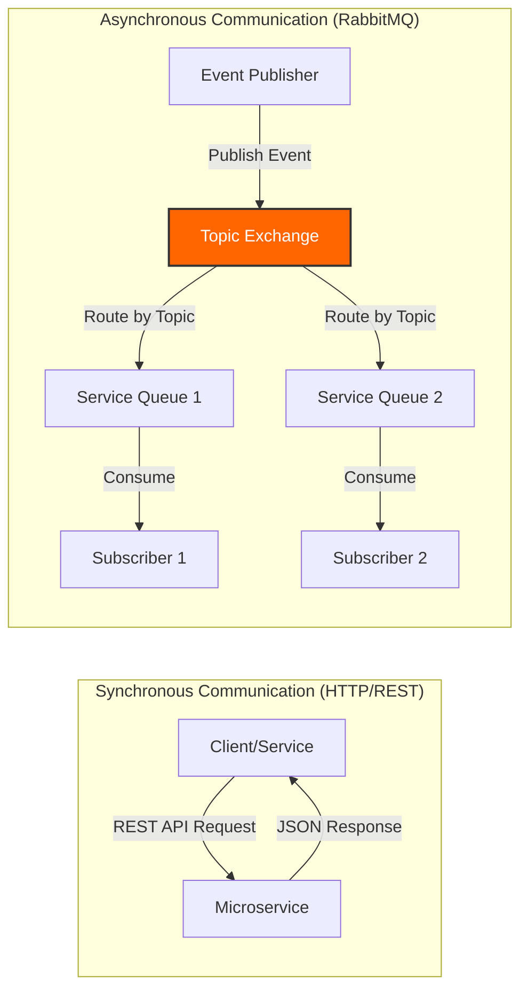
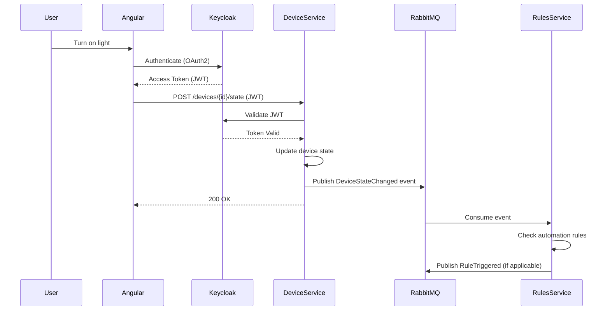
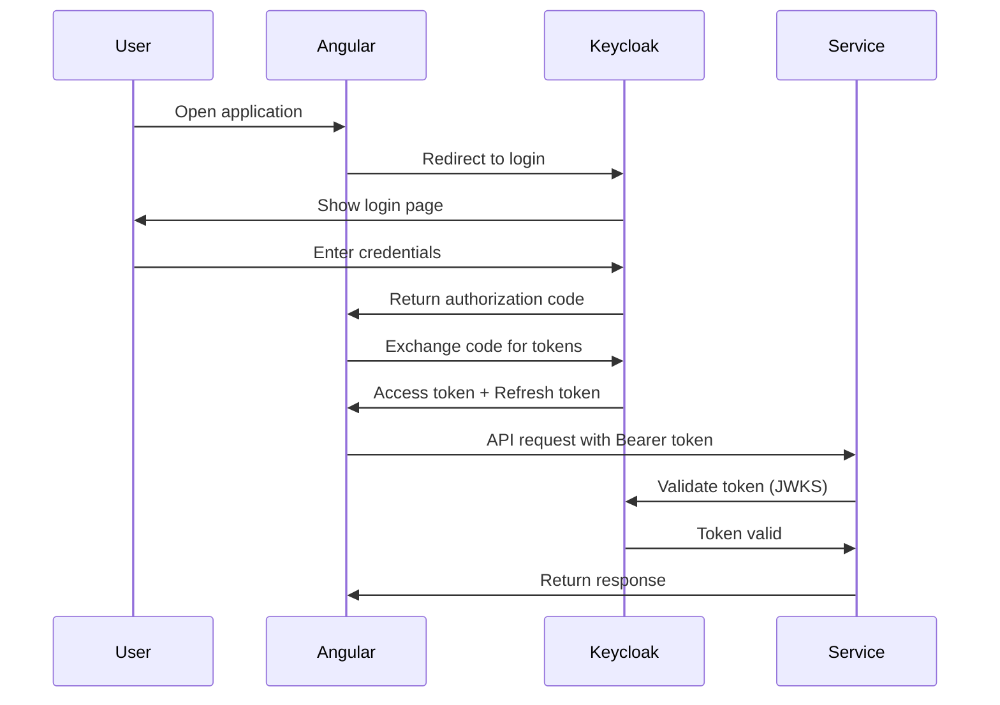

# Sarah - Smart Home Management System

> A modern smart home management platform built with microservices architecture

## Overview

**Sarah** is an intelligent smart home management system that enables you to monitor, control, and automate your connected devices through a powerful microservices architecture. Built with .NET 10 and Angular, Sarah provides a scalable, event-driven platform for managing lights, sensors, switches, and other IoT devices with advanced features like geofencing, voice control, and automation rules.

### Key Features

✨ **Device Management** - Centralized control for all smart home devices  
🔐 **Enterprise Security** - OAuth2/OIDC authentication via Keycloak  
📍 **Geofencing** - Location-based automation and triggers  
🎤 **Voice Control** - Speech recognition and text-to-speech capabilities  
⚡ **Event-Driven** - Real-time updates via RabbitMQ message broker  
📊 **Monitoring** - System health tracking and metrics  
🤖 **Automation** - Flexible rule engine for device automation  
🏠 **Room Management** - Organize devices by room and location

## Technology Stack

| Category | Technology | Purpose |
|----------|-----------|---------|
| **Backend Framework** | .NET 10 / ASP.NET Core | Microservices runtime |
| **Frontend Framework** | Angular 18+ | Single-page application |
| **Identity & Access** | Keycloak | OAuth2/OIDC authentication |
| **Message Broker** | RabbitMQ 3.x | Event-driven communication |
| **Database** | PostgreSQL 16 | Data persistence per service |
| **ORM** | Entity Framework Core | Database access layer |
| **Orchestration** | .NET Aspire 13.x | Development orchestration |
| **Containerization** | Docker & Docker Compose | Production deployment |
| **API Documentation** | OpenAPI/Swagger | REST API specification |

## Architecture

### High-Level System Architecture

Sarah follows a microservices architecture with clear separation of concerns, event-driven communication, and centralized authentication.

```mermaid
graph TB
    subgraph "Client Layer"
        Angular["Angular SPA<br/>(Port 4200)<br/>Modern UI"]
    end
    
    subgraph "Identity & Access Management"
        Keycloak["Keycloak IDP<br/>(Ports 8080/8443)<br/>OAuth2/OIDC"]
    end
    
    subgraph "Microservices Layer"
        DeviceService["Device Service<br/>(Port 5001)<br/>Device Management"]
        PersonsService["Persons Service<br/>(Port 5002)<br/>User Management"]
        GeofencesService["Geofences Service<br/>(Port 5003)<br/>Location Tracking"]
        MonitoringService["Monitoring Service<br/>(Port 5005)<br/>System Monitoring"]
        RulesService["Rules Service<br/>(Port 5006)<br/>Automation Rules"]
        SpeechServer["Speech Server<br/>(Port 5011)<br/>Voice Commands"]
    end
    
    subgraph "Infrastructure Layer"
        RabbitMQ["RabbitMQ<br/>(Ports 5672/15672)<br/>Message Broker<br/>Topic Exchanges"]
        
        subgraph "PostgreSQL Databases"
            DB1["devicesdb<br/>(Port 5432)"]
            DB2["personsdb<br/>(Port 5433)"]
            DB3["geofencesdb<br/>(Port 5434)"]
            DB4["monitoringdb<br/>(Port 5436)"]
            DB5["rulesdb<br/>(Port 5437)"]
        end
    end
    
    %% Client connections
    Angular -->|HTTPS/JWT| DeviceService
    Angular -->|HTTPS/JWT| PersonsService
    Angular -->|HTTPS/JWT| GeofencesService
    Angular -->|OAuth2/OIDC Login| Keycloak
    
    %% Microservice authentication
    DeviceService -->|JWT Validation| Keycloak
    PersonsService -->|JWT Validation| Keycloak
    GeofencesService -->|JWT Validation| Keycloak
    MonitoringService -->|JWT Validation| Keycloak
    RulesService -->|JWT Validation| Keycloak
    SpeechServer -->|JWT Validation| Keycloak
    
    %% Event-driven communication (RabbitMQ)
    DeviceService -.->|Pub/Sub Events| RabbitMQ
    PersonsService -.->|Pub/Sub Events| RabbitMQ
    GeofencesService -.->|Pub/Sub Events| RabbitMQ
    MonitoringService -.->|Pub/Sub Events| RabbitMQ
    RulesService -.->|Pub/Sub Events| RabbitMQ
    SpeechServer -.->|Pub/Sub Events| RabbitMQ
    
    %% Database connections
    DeviceService -->|Read/Write| DB1
    PersonsService -->|Read/Write| DB2
    GeofencesService -->|Read/Write| DB3
    MonitoringService -->|Read/Write| DB4
    RulesService -->|Read/Write| DB5
    
    style Angular fill:#4285f4,stroke:#333,stroke-width:2px,color:#fff
    style Keycloak fill:#008aaa,stroke:#333,stroke-width:2px,color:#fff
    style RabbitMQ fill:#ff6600,stroke:#333,stroke-width:2px,color:#fff
```



### Service Communication Patterns

Sarah uses two complementary communication patterns:



**Synchronous (HTTP/REST)**:
- Client-to-service requests (Angular → Services)
- JWT token authentication on every request
- RESTful API endpoints with OpenAPI documentation

**Asynchronous (RabbitMQ Topic Exchanges)**:
- Device state changes and sensor readings
- Speech events (voice commands, text-to-speech)
- Person availability and location updates
- Geofence entry/exit events
- System monitoring metrics
- Automation rule triggers

### Event Flow Example



### Key Components

#### Frontend Layer
- **Angular SPA** (Port 4200): Modern single-page application
  - Built with Angular 18+
  - Secure authentication via OAuth2/OpenID Connect
  - Real-time device control and monitoring
  - Responsive design for desktop and mobile

#### Microservices Layer
- **Device Service** (Port 5001): Smart device management
  - CRUD operations for devices (lights, sensors, switches)
  - Device state management and control
  - PostgreSQL database: `devicesdb`
  
- **Persons Service** (Port 5002): User and person management
  - User profiles and preferences
  - Person tracking and availability
  - PostgreSQL database: `personsdb`
  
- **Geofences Service** (Port 5003): Location-based automation
  - Geofence definitions and boundaries
  - Location tracking and entry/exit detection
  - Automation triggers based on location
  - PostgreSQL database: `geofencesdb`
  
- **Monitoring Service** (Port 5005): System health and metrics
  - Service health checks
  - Performance metrics collection
  - System monitoring dashboards
  - PostgreSQL database: `monitoringdb`
  
- **Rules Service** (Port 5006): Automation engine
  - Rule definitions (if-then-else logic)
  - Event-driven rule execution
  - Automation workflows
  - PostgreSQL database: `rulesdb`
  
- **Speech Server** (Port 5011): Voice interaction
  - Voice command recognition
  - Text-to-speech synthesis
  - Natural language processing

#### Infrastructure Layer
- **Keycloak** (Ports 8080 HTTP / 8443 HTTPS): Identity Provider
  - OAuth2 and OpenID Connect authentication
  - JWT token issuance and validation
  - User realm: `sarah-realm`
  - Role-based access control
  
- **RabbitMQ** (Ports 5672 AMQP / 15672 Management): Message Broker
  - Topic-based exchanges for event distribution
  - Durable queues for reliability
  - Event-driven inter-service communication
  - Management UI for monitoring
  
- **PostgreSQL 16** (Multiple databases): Data Persistence
  - Separate database per microservice
  - Database-per-service pattern for data isolation
  - Entity Framework Core for ORM
  - Migration support
  - Ports: 5432-5437 (one per database)

### Security

All services implement JWT bearer token authentication validated against Keycloak:
- Every API request requires a valid access_token
- Tokens are validated against the configured Keycloak realm
- Services verify token signature, issuer, audience, and expiration
- SSL/TLS encryption for all communications in production

#### Security Best Practices Implemented

**✓ Shared Authentication Library**: 
- Centralized JWT authentication configuration (`Sarah.Authentication` library)
- Eliminates code duplication across microservices
- Consistent security policy enforcement

**✓ Resource Management**: 
- Shared HttpClient instance prevents socket exhaustion
- Proper resource lifecycle management

**✓ Environment-Aware Security**:
- SSL certificate validation enabled in production
- HTTPS metadata validation enforced in non-development environments
- Self-signed certificates supported only in development

**✓ Credential Management**:
- Environment variables for sensitive credentials
- `.env` file support with `.env.example` template
- No hardcoded passwords in docker-compose files
- `.gitignore` configured to prevent credential leaks

**⚠️ Known Limitations**:
- IssuerSigningKeyResolver uses `.Result` (synchronous blocking) due to framework limitations
- Signing keys are cached by JWT middleware, minimizing performance impact

## .NET Aspire Integration

### What is .NET Aspire?

**.NET Aspire** is an opinionated stack for building observable, production-ready distributed applications. It provides:

- **Service Orchestration**: Simplified management of multiple services and dependencies
- **Service Discovery**: Automatic service-to-service communication configuration
- **Observability**: Built-in telemetry, logging, and health checks
- **Local Development**: Streamlined developer experience with dashboard UI
- **Resource Management**: Simplified configuration of databases, message brokers, and caches

### Aspire Architecture in Sarah

```mermaid
graph TB
    subgraph "Aspire Dashboard"
        Dashboard["Aspire Dashboard<br/>Centralized Monitoring"]
    end
    
    subgraph "AppHost Orchestration"
        AppHost["Sarah.AppHost<br/>Service Orchestrator"]
    end
    
    subgraph "Infrastructure (Containers)"
        Keycloak_C["Keycloak Container<br/>Port 8443"]
        RabbitMQ_C["RabbitMQ Container<br/>Ports 5672/15672"]
        Postgres_C["PostgreSQL Container<br/>Multiple Databases"]
    end
    
    subgraph "Microservices (Projects)"
        Device["DeviceService<br/>Port 5001"]
        Persons["PersonsService<br/>Port 5002"]
        Geofences["GeofencesService<br/>Port 5003"]
        Monitoring["MonitoringService<br/>Port 5005"]
        Rules["RulesService<br/>Port 5006"]
        Speech["SpeechServer<br/>Port 5011"]
    end
    
    subgraph "Frontend"
        Frontend["Angular SPA<br/>Port 4200"]
    end
    
    AppHost -->|Orchestrates| Keycloak_C
    AppHost -->|Orchestrates| RabbitMQ_C
    AppHost -->|Orchestrates| Postgres_C
    AppHost -->|Launches| Device
    AppHost -->|Launches| Persons
    AppHost -->|Launches| Geofences
    AppHost -->|Launches| Monitoring
    AppHost -->|Launches| Rules
    AppHost -->|Launches| Speech
    AppHost -->|Launches| Frontend
    
    Device -->|References| Postgres_C
    Device -->|References| Keycloak_C
    Device -->|References| RabbitMQ_C
    
    Persons -->|References| Postgres_C
    Persons -->|References| Keycloak_C
    Persons -->|References| RabbitMQ_C
    
    Dashboard -.->|Monitors| AppHost
    Dashboard -.->|Logs & Metrics| Device
    Dashboard -.->|Logs & Metrics| Persons
    
    style AppHost fill:#512bd4,stroke:#333,stroke-width:2px,color:#fff
    style Dashboard fill:#512bd4,stroke:#333,stroke-width:2px,color:#fff
```

### Aspire Project Structure

The Sarah project uses .NET Aspire for orchestration through the `Sarah.AppHost` project:

```
Sarah.AppHost/
├── Program.cs              # Service orchestration configuration
├── Sarah.AppHost.csproj    # Aspire project file
└── appsettings.*.json      # Environment-specific settings
```

**Key Configuration Highlights** (`Program.cs`):
- Infrastructure containers: Keycloak, RabbitMQ, PostgreSQL
- Service references and dependencies
- Port mappings and environment configuration
- Database-per-service pattern with single PostgreSQL instance

### Benefits of Aspire in Sarah

1. **Simplified Local Development**
   - Single command to start entire ecosystem
   - Automatic service discovery and configuration
   - Centralized dashboard for all services

2. **Infrastructure as Code**
   - Infrastructure dependencies defined in code
   - Version-controlled service configuration
   - Reproducible development environments

3. **Enhanced Observability**
   - Built-in telemetry and distributed tracing
   - Centralized logging across services
   - Real-time health monitoring

4. **Dependency Management**
   - Automatic injection of connection strings
   - Service reference management
   - Configuration propagation

### ⚠️ Important Notes

- **.NET Aspire is EXPERIMENTAL**: Use for development and testing only
- **Docker Compose is RECOMMENDED for production**: More mature, stable, and widely adopted
- **Aspire workload deprecated**: Now uses NuGet packages instead of SDK workload
- **Full integration in progress**: Some services may need manual configuration

### Communication Patterns

1. **Synchronous**: REST APIs between Gateway and Microservices
2. **Asynchronous**: RabbitMQ topic exchanges for events
   - Network events (sensor readings, device states)
   - Speech events (voice commands, TTS)
   - Person availability events
   - Geofence events
   - Weather and environmental events

## Getting Started

### Prerequisites

- **[.NET 10 SDK](https://dotnet.microsoft.com/download/dotnet/10.0)** - Required for running microservices
- **[Node.js 20+](https://nodejs.org/)** - Required for Angular frontend
- **[Docker Desktop](https://www.docker.com/)** - Required for containerized services
- **[Docker Compose](https://docs.docker.com/compose/)** - Included with Docker Desktop
- **[Git](https://git-scm.com/)** - For cloning the repository

### Three Ways to Run Sarah

Sarah can be run in three different modes depending on your needs:

| Method | Best For | Complexity | Production Ready |
|--------|----------|------------|------------------|
| **Docker Compose** | Local Development, Testing | Low | ❌ No (Dev Mode) |
| **.NET Aspire** | Development, Learning | Medium | ⚠️ Experimental |
| **Manual Setup** | Debugging, Development | High | ❌ No |

---

### Option 1: Docker Compose (Recommended for Local Development)

Docker Compose provides a complete local development environment with all services pre-configured. Note: The current compose file runs services in development mode and is not hardened for production use.

#### Step 1: Clone the Repository

```bash
git clone https://github.com/fondencn/sarah.git
cd sarah
```

#### Step 2: Configure Credentials (IMPORTANT)

```bash
# Copy the example environment file
cp .env.example .env

# Edit .env with your preferred editor and set strong passwords
nano .env  # or vim, code, etc.
```

Update the following in `.env`:
```env
# Use strong, unique passwords for production!
KEYCLOAK_ADMIN=admin
KEYCLOAK_ADMIN_PASSWORD=YourStrongPassword123!

RABBITMQ_USER=sarahuser
RABBITMQ_PASSWORD=YourStrongPassword456!

POSTGRES_USER=postgres
POSTGRES_PASSWORD=YourStrongPassword789!
```

> 🔒 **Security Note**: Never commit `.env` with real credentials to version control!

#### Step 3: Start All Services

```bash
docker-compose -f docker-compose.microservices.yml up --build
```

This will start:
- ✅ Keycloak (Identity Provider)
- ✅ RabbitMQ (Message Broker)
- ✅ PostgreSQL containers for devices, persons, geofences, monitoring, and rules
- ✅ 6 microservices (Device, Persons, Geofences, Monitoring, Rules, Speech)
- ✅ Angular frontend

**First run**: Takes 2-3 minutes for Keycloak to initialize

#### Step 4: Configure Keycloak (First Time Only)

1. Open Keycloak Admin Console: http://localhost:8080
2. Login with credentials from your `.env` file (default: `admin`/`admin`)
3. Create a new realm:
   - Click **"Create Realm"**
   - Name: `sarah-realm`
   - Click **"Create"**
4. Create a client:
   - Navigate to **Clients** → **"Create client"**
   - Client ID: `sarah-client`
   - Click **"Next"** → **"Save"**
5. Configure client settings:
   - **Valid redirect URIs**: `http://localhost:4200/*`
   - **Web origins**: `http://localhost:4200`
   - **Direct Access Grants**: Enable
   - Click **"Save"**

#### Step 5: Access Services

Once all services are running, access them at:

| Service | URL | Credentials |
|---------|-----|-------------|
| **Frontend (Angular)** | http://localhost:4200 | (via Keycloak) |
| **Device Service** | http://localhost:5001 | JWT required |
| **Persons Service** | http://localhost:5002 | JWT required |
| **Geofences Service** | http://localhost:5003 | JWT required |
| **Monitoring Service** | http://localhost:5005 | JWT required |
| **Rules Service** | http://localhost:5006 | JWT required |
| **Speech Server** | http://localhost:5011 | JWT required |
| **Keycloak Admin** | http://localhost:8080 | From `.env` |
| **RabbitMQ Management** | http://localhost:15672 | From `.env` |
| **PostgreSQL** | localhost:5432-5437 | From `.env` |

#### Step 6: Stop Services

```bash
# Stop services but keep data
docker-compose -f docker-compose.microservices.yml stop

# Stop services and remove containers (data persists in volumes)
docker-compose -f docker-compose.microservices.yml down

# Stop services and remove all data (⚠️ destructive)
docker-compose -f docker-compose.microservices.yml down -v
```

---

### Option 2: .NET Aspire (Experimental Development)

> ⚠️ **.NET Aspire is experimental** - Use for development and learning only. Docker Compose is recommended for production.

.NET Aspire provides a streamlined development experience with a centralized dashboard for service orchestration.

#### Prerequisites
- .NET 9 SDK with Aspire support
- Docker Desktop (for infrastructure containers)

#### Step 1: Run the AppHost

```bash
cd Sarah.AppHost
dotnet run
```

#### Step 2: Access the Aspire Dashboard

The Aspire dashboard will automatically open in your browser, showing:
- 📊 All running services and containers
- 📝 Real-time logs from each service
- 🔍 Distributed tracing
- 📈 Metrics and health checks

Default URL: `https://localhost:17234` (or as shown in console output)

#### Step 3: Configure Services

Aspire will automatically:
- ✅ Start Keycloak, RabbitMQ, and PostgreSQL containers
- ✅ Launch all microservices
- ✅ Configure connection strings and service discovery
- ✅ Start the Angular frontend

You'll still need to configure Keycloak (see Docker Compose Step 4 above).

#### What Aspire Does for You

```
✓ Service Discovery: Automatic configuration of service URLs
✓ Connection Strings: Injected from infrastructure resources
✓ Health Checks: Built-in endpoint monitoring
✓ Logging: Centralized log aggregation
✓ Telemetry: Distributed tracing across services
✓ Dashboard UI: Visual overview of entire system
```

#### Limitations

- Aspire workload deprecated in favor of NuGet packages
- Not all service integrations may be complete
- Experimental features may change
- Not suitable for production deployments

---

### Option 3: Manual Development Setup

For fine-grained control and debugging individual services.

#### Step 1: Start Infrastructure Services

```bash
docker-compose -f docker-compose.microservices.yml up keycloak rabbitmq postgres-devices postgres-persons postgres-geofences postgres-monitoring postgres-rules
```

#### Step 2: Configure Keycloak

Follow Keycloak configuration steps from Docker Compose Option (Step 4).

#### Step 3: Run Microservices Individually

Open separate terminal windows for each service:

```bash
# Terminal 1 - Device Service
cd Microservices/Sarah.DeviceService.WebApi
dotnet run

# Terminal 2 - Persons Service
cd Microservices/Sarah.Persons.WebApi
dotnet run

# Terminal 3 - Geofences Service
cd Microservices/Sarah.Geofences.WebApi
dotnet run

# Terminal 4 - Monitoring Service
cd Microservices/Sarah.Monitoring.WebApi
dotnet run

# Terminal 5 - Rules Service
cd Microservices/Sarah.Rules.WebApi
dotnet run

# Terminal 6 - Speech Server
cd Microservices/Sarah.SpeechServer.WebApi
dotnet run

# Terminal 7 - Angular Frontend
cd sarah.client
npm install
npm start
```

#### Step 4: Access Services

When running with `dotnet run`, each service listens on ports configured in its `launchSettings.json` (not the Docker Compose ports). For example:
- Device Service: `http://localhost:5143` (not 5001)
- Other services have their own default ports in `launchSettings.json`

To use the Docker Compose port mappings with `dotnet run`, specify URLs explicitly:
```bash
dotnet run --urls "http://localhost:5001"
```

#### Benefits of Manual Setup

- 🐛 **Debugging**: Attach debugger to individual services
- 🔧 **Development**: Make changes without rebuilding containers
- 🎯 **Selective Running**: Run only the services you need
- 📝 **Learning**: Understand service dependencies and configuration

## Configuration

### Service Configuration

Each microservice can be configured via `appsettings.json`, environment variables, or command-line arguments.

#### Keycloak/JWT Configuration

```json
{
  "OIDCAuthority": "http://keycloak:8080/realms/sarah-realm",
  "Jwt": {
    "Issuer": "http://keycloak:8080/realms/sarah-realm",
    "Audience": "account"
  }
}
```

> **Note**: `RequireHttpsMetadata` is automatically set based on the environment (`false` in Development, `true` in Production) and is not read from configuration.

**Environment Variables** (Docker Compose):
```bash
OIDCAuthority=http://keycloak:8080/realms/sarah-realm
Jwt__Issuer=http://keycloak:8080/realms/sarah-realm
Jwt__Audience=account
```

#### RabbitMQ Configuration

```json
{
  "RabbitMQ": {
    "HostName": "rabbitmq",
    "Port": 5672,
    "UserName": "your-username",
    "Password": "your-password"
  }
}
```

**Environment Variables**:
```bash
RabbitMQ__HostName=rabbitmq
RabbitMQ__Port=5672
RabbitMQ__UserName=sarahuser
RabbitMQ__Password=YourPassword
```

#### Database Configuration

Each service uses its own PostgreSQL database with the connection string key `PostgresConnection`:

```json
{
  "ConnectionStrings": {
    "PostgresConnection": "Host=postgres-devices;Database=devicesdb;Username=postgres;Password=yourpassword"
  }
}
```

**Environment Variables**:
```bash
ConnectionStrings__PostgresConnection=Host=postgres-devices;Database=devicesdb;Username=postgres;Password=yourpassword
```

### Port Mappings Reference

| Service | Internal Port | External Port | Protocol |
|---------|--------------|---------------|----------|
| Angular Frontend | 4200 | 4200 | HTTP |
| Device Service | 8080 | 5001 | HTTP |
| Persons Service | 8080 | 5002 | HTTP |
| Geofences Service | 8080 | 5003 | HTTP |
| Monitoring Service | 8080 | 5005 | HTTP |
| Rules Service | 8080 | 5006 | HTTP |
| Speech Server | 8080 | 5011 | HTTP |
| Keycloak | 8080 | 8080 | HTTP |
| Keycloak (HTTPS) | 8443 | 8443 | HTTPS |
| RabbitMQ AMQP | 5672 | 5672 | AMQP |
| RabbitMQ Management | 15672 | 15672 | HTTP |
| PostgreSQL (devices) | 5432 | 5432 | TCP |
| PostgreSQL (persons) | 5432 | 5433 | TCP |
| PostgreSQL (geofences) | 5432 | 5434 | TCP |
| PostgreSQL (monitoring) | 5432 | 5436 | TCP |
| PostgreSQL (rules) | 5432 | 5437 | TCP |

## Development

### Project Structure

```
sarah/
├── .aspire/                        # Aspire configuration
├── .github/                        # GitHub Actions workflows
├── .vscode/                        # VS Code settings
├── Libs/                           # Shared libraries
│   ├── Sarah.API/                  # Common API models
│   ├── Sarah.Authentication/       # JWT authentication library
│   ├── Sarah.DeviceServiceClient/  # Device service client
│   ├── Sarah.LEDService/           # LED device logic
│   ├── Sarah.Messaging.RabbitMQ/   # RabbitMQ messaging
│   ├── Sarah.SpeakerEventClient/   # Speaker client
│   └── Sarah.Voice/                # Voice processing
├── Microservices/                  # Microservice applications
│   ├── Sarah.DeviceService.WebApi/
│   │   ├── Controllers/            # API endpoints
│   │   ├── Data/                   # DbContext
│   │   ├── DTOs/                   # Data transfer objects
│   │   ├── Migrations/             # EF migrations
│   │   ├── Services/               # Business logic
│   │   └── Program.cs
│   ├── Sarah.Persons.WebApi/
│   ├── Sarah.Geofences.WebApi/
│   ├── Sarah.RoomService.WebApi/
│   ├── Sarah.Monitoring.WebApi/
│   ├── Sarah.Rules.WebApi/
│   └── Sarah.SpeechServer.WebApi/
├── Sarah.AppHost/                  # .NET Aspire orchestration
│   ├── Program.cs                  # Aspire configuration
│   └── Sarah.AppHost.csproj
├── sarah.client/                   # Angular frontend
│   ├── src/
│   │   ├── app/                    # Angular components
│   │   ├── assets/                 # Static assets
│   │   └── environments/           # Environment configs
│   ├── angular.json
│   └── package.json
├── docker-compose.microservices.yml # Production deployment
├── .env.example                    # Environment template
├── Sarah.sln                       # Solution file
└── README.md                       # This file
```

### Building the Project

#### Build All .NET Projects

```bash
# Restore dependencies
dotnet restore Sarah.sln

# Build solution
dotnet build Sarah.sln

# Build in Release mode
dotnet build Sarah.sln -c Release
```

#### Build Individual Services

```bash
cd Microservices/Sarah.DeviceService.WebApi
dotnet build
```

#### Build Angular Frontend

```bash
cd sarah.client

# Install dependencies
npm install

# Development build
npm run build

# Production build
npm run build -- --configuration production
```

### Running Tests

```bash
# Run all .NET tests
dotnet test Sarah.sln

# Run tests with coverage
dotnet test Sarah.sln --collect:"XPlat Code Coverage"

# Run Angular tests
cd sarah.client
npm test

# Run Angular e2e tests
npm run e2e
```

### Database Migrations

Each service manages its own database migrations with Entity Framework Core:

```bash
# Create a new migration
cd Microservices/Sarah.DeviceService.WebApi
dotnet ef migrations add MigrationName

# Apply migrations
dotnet ef database update

# Rollback migration
dotnet ef database update PreviousMigrationName

# Generate SQL script
dotnet ef migrations script
```

### API Documentation

Each service exposes OpenAPI/Swagger documentation:

- Device Service: http://localhost:5001/swagger
- Persons Service: http://localhost:5002/swagger
- Geofences Service: http://localhost:5003/swagger
- Room Service: http://localhost:5004/swagger
- Monitoring Service: http://localhost:5005/swagger
- Rules Service: http://localhost:5006/swagger
- Speech Server: http://localhost:5008/swagger

### Code Style and Linting

```bash
# Format C# code
dotnet format Sarah.sln

# Format with verification
dotnet format Sarah.sln --verify-no-changes

# Lint Angular code
cd sarah.client
npm run lint

# Fix linting issues
npm run lint -- --fix
```

## Usage Examples

### Device Management

**Add a New Device**:
```bash
curl -X POST http://localhost:5001/api/devices \
  -H "Authorization: Bearer $TOKEN" \
  -H "Content-Type: application/json" \
  -d '{
    "name": "Living Room Light",
    "type": "light",
    "roomId": "123"
  }'
```

**Control a Device**:
```bash
curl -X PUT http://localhost:5001/api/devices/{id}/state \
  -H "Authorization: Bearer $TOKEN" \
  -H "Content-Type: application/json" \
  -d '{ "state": "on", "brightness": 80 }'
```

### Automation Rules

**Create an Automation Rule**:
```bash
curl -X POST http://localhost:5006/api/rules \
  -H "Authorization: Bearer $TOKEN" \
  -H "Content-Type: application/json" \
  -d '{
    "name": "Turn on lights at sunset",
    "trigger": "time",
    "condition": "sunset",
    "actions": [
      { "deviceId": "123", "action": "turn_on" }
    ]
  }'
```

### Geofencing

**Create a Geofence**:
```bash
curl -X POST http://localhost:5003/api/geofences \
  -H "Authorization: Bearer $TOKEN" \
  -H "Content-Type: application/json" \
  -d '{
    "name": "Home",
    "latitude": 37.7749,
    "longitude": -122.4194,
    "radius": 100
  }'
```

### Voice Commands

Send voice commands through the Speech Server to control devices using natural language.

## Monitoring and Observability

### Health Checks

Each service exposes a status endpoint for health monitoring:

```bash
# Device service status
curl http://localhost:5001/api/devices/status

# Geofences service status
curl http://localhost:5003/api/geofences/status

# Rules service status
curl http://localhost:5006/api/rules/status
```

### RabbitMQ Management

Access the RabbitMQ management console at http://localhost:15672 to:
- Monitor message queues
- View exchange configurations
- Track message rates
- Debug message routing

### Service Logs

#### Docker Compose Logs
```bash
# View all logs
docker-compose -f docker-compose.microservices.yml logs

# Follow logs in real-time
docker-compose -f docker-compose.microservices.yml logs -f

# View specific service logs
docker-compose -f docker-compose.microservices.yml logs deviceservice

# Tail last 100 lines
docker-compose -f docker-compose.microservices.yml logs --tail=100 -f
```

#### Aspire Dashboard
When using .NET Aspire, access the dashboard for integrated logging and telemetry across all services.

## Troubleshooting

### Common Issues

**Keycloak not starting**:
- Wait 30-60 seconds on first run for initialization
- Check logs: `docker-compose logs keycloak`
- Verify port 8080 is not in use

**Services can't connect to Keycloak**:
- Ensure Keycloak realm `sarah-realm` is created
- Verify client `sarah-client` is configured
- Check JWT issuer matches realm URL

**RabbitMQ connection errors**:
- Verify RabbitMQ is healthy: `docker-compose ps`
- Check credentials in `.env` file
- Ensure port 5672 is not blocked

**Database connection errors**:
- Check PostgreSQL containers are running
- Verify connection strings in environment variables
- Run migrations: `dotnet ef database update`

**Port conflicts**:
- Check if ports are already in use: `netstat -an | grep LISTEN`
- Modify port mappings in `docker-compose.microservices.yml`
- Update service configurations accordingly

## Authentication and Authorization

Sarah uses a comprehensive OAuth2 with OpenID Connect (OIDC) authentication flow:

### Authentication Flow



### Token Management

- **Access Tokens**: Short-lived (default: 5 minutes)
- **Refresh Tokens**: Long-lived (default: 30 minutes)
- **Token Validation**: Performed by each microservice using Keycloak JWKS endpoint
- **Token Storage**: Secure storage in Angular (HttpOnly cookies recommended)

### Authorization

Services use claims-based authorization:
- **Roles**: Define user permissions (admin, user, viewer)
- **Scopes**: Define API access levels
- **Claims**: Additional user attributes for fine-grained control

## Performance and Scalability

### Scalability Considerations

Sarah's microservices architecture enables horizontal scaling:

- **Stateless Services**: All microservices are stateless (session state in JWT)
- **Database Per Service**: Independent scaling of data layer
- **Message Queue**: RabbitMQ buffers events during high load
- **Container Orchestration**: Easy to deploy on Kubernetes or Docker Swarm

### Performance Best Practices

1. **Connection Pooling**: PostgreSQL and RabbitMQ use connection pools
2. **Caching**: Consider Redis for frequently accessed data
3. **Async Operations**: RabbitMQ for non-blocking operations
4. **Load Balancing**: Use reverse proxy (nginx, traefik) for production

## Deployment

### Production Deployment Checklist

- [ ] Use strong, unique passwords for all services (`.env`)
- [ ] Enable HTTPS/TLS for all services
- [ ] Set `ASPNETCORE_ENVIRONMENT=Production`
- [ ] Configure `Jwt__RequireHttpsMetadata=true`
- [ ] Use managed databases (instead of containers)
- [ ] Set up backup and disaster recovery
- [ ] Configure monitoring and alerting
- [ ] Use reverse proxy with rate limiting
- [ ] Enable CORS only for trusted origins
- [ ] Review and harden Keycloak configuration
- [ ] Use secrets management (Azure Key Vault, AWS Secrets Manager)

### Docker Production Optimization

```yaml
# Example production docker-compose optimizations
services:
  deviceservice:
    restart: unless-stopped
    deploy:
      resources:
        limits:
          cpus: '1'
          memory: 512M
        reservations:
          cpus: '0.5'
          memory: 256M
    healthcheck:
      test: ["CMD", "curl", "-f", "http://localhost:8080/health"]
      interval: 30s
      timeout: 10s
      retries: 3
```

## Contributing

Contributions are welcome! Please follow these guidelines:

### How to Contribute

1. **Fork the repository** on GitHub
2. **Create a feature branch**: `git checkout -b feature/amazing-feature`
3. **Make your changes** with clear, descriptive commits
4. **Add tests** for new functionality
5. **Ensure all tests pass**: `dotnet test && npm test`
6. **Format your code**: `dotnet format && npm run lint`
7. **Submit a pull request** with a clear description

### Code Standards

- Follow [C# Coding Conventions](https://docs.microsoft.com/en-us/dotnet/csharp/fundamentals/coding-style/coding-conventions)
- Follow [Angular Style Guide](https://angular.io/guide/styleguide)
- Write meaningful commit messages
- Add XML documentation for public APIs
- Include unit tests for business logic
- Update documentation for user-facing changes

### Reporting Issues

When reporting issues, please include:
- Clear description of the problem
- Steps to reproduce
- Expected vs actual behavior
- Environment details (.NET version, OS, etc.)
- Relevant logs or error messages

## Roadmap

Future enhancements planned for Sarah:

- 🔄 **WebSocket Support**: Real-time bidirectional communication
- 📱 **Mobile App**: Native iOS and Android applications
- 🤖 **AI Integration**: Machine learning for predictive automation
- 🔌 **Plugin System**: Extensible device driver architecture
- 📊 **Advanced Analytics**: Historical data analysis and insights
- 🌐 **Multi-Tenant**: Support for multiple households
- 🔐 **2FA Support**: Two-factor authentication
- 🏠 **Kubernetes Support**: Container orchestration for scaling

## Resources

### Documentation
- [.NET Aspire Documentation](https://learn.microsoft.com/en-us/dotnet/aspire/)
- [Keycloak Documentation](https://www.keycloak.org/documentation)
- [RabbitMQ Documentation](https://www.rabbitmq.com/documentation.html)
- [Angular Documentation](https://angular.io/docs)

### Related Projects
- [.NET Microservices Architecture](https://dotnet.microsoft.com/apps/aspnet/microservices)
- [Keycloak Angular Adapter](https://www.npmjs.com/package/keycloak-angular)
- [MassTransit](https://masstransit-project.com/) - Advanced messaging patterns

## License

This project is licensed under the MIT License. See the [LICENSE](LICENSE) file for details.

### MIT License Summary

- ✅ **Commercial use** - Use in commercial applications
- ✅ **Modification** - Modify the source code
- ✅ **Distribution** - Distribute the software
- ✅ **Private use** - Use privately
- ⚠️ **Liability** - No warranty provided
- ⚠️ **Warranty** - Provided "as is" without warranty

## Contact and Support

- **GitHub Issues**: [Report bugs or request features](https://github.com/fondencn/sarah/issues)
- **Discussions**: [Ask questions and share ideas](https://github.com/fondencn/sarah/discussions)
- **Author**: Chris (fondencn)

---

## Acknowledgments

Built with ❤️ using:
- [.NET](https://dotnet.microsoft.com/)
- [Angular](https://angular.io/)
- [Keycloak](https://www.keycloak.org/)
- [RabbitMQ](https://www.rabbitmq.com/)
- [PostgreSQL](https://www.postgresql.org/)
- [Docker](https://www.docker.com/)

Special thanks to the open-source community for these amazing tools!

---

**Star ⭐ this repository if you find it helpful!**
