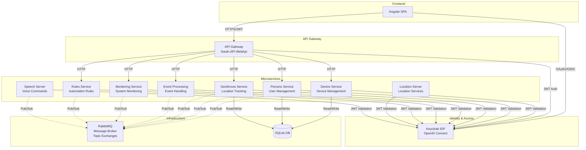

# Sarah - Smart Home Management System

Chris's Smart Home with Microservice Architecture

## Architecture Overview

Sarah is a modern smart home management system built on a microservice architecture using .NET 9, Angular, Keycloak for identity management, and RabbitMQ for event-driven communication.

### Architecture Diagram



### Key Components

#### Frontend Layer
- **Angular SPA**: Modern single-page application providing the user interface
  - Built with Angular 18+
  - Secure authentication via OAuth2/OpenID Connect
  - Real-time updates through WebSockets

#### API Gateway
- **Sarah.API.WebApi**: Central entry point for all client requests
  - Request routing to appropriate microservices
  - JWT token validation
  - Cross-cutting concerns (logging, monitoring)

#### Microservices Layer
- **Device Service**: Manages smart home devices (lights, sensors, switches)
- **Persons Service**: User and person management
- **Geofences Service**: Location-based automation and tracking
- **Event Processing Service**: Handles system events and notifications
- **Monitoring Service**: System health and metrics
- **Rules Service**: Automation rules and triggers
- **Location Server**: GPS and location services
- **Speech Server**: Voice command processing and text-to-speech

#### Infrastructure Layer
- **Keycloak**: Identity Provider (IDP)
  - OAuth2 and OpenID Connect authentication
  - JWT token management
  - User realm: `sarah-realm`
- **RabbitMQ**: Message Broker
  - Topic-based exchanges for event distribution
  - Asynchronous inter-service communication
  - Event-driven architecture
- **SQLite**: Data persistence
  - Lightweight embedded database
  - Device configurations and state
  - User preferences and history

### Security

All services implement JWT bearer token authentication validated against Keycloak:
- Every API request requires a valid access_token
- Tokens are validated against the configured Keycloak realm
- Services verify token signature, issuer, audience, and expiration
- SSL/TLS encryption for all communications in production

### Communication Patterns

1. **Synchronous**: REST APIs between Gateway and Microservices
2. **Asynchronous**: RabbitMQ topic exchanges for events
   - Network events (sensor readings, device states)
   - Speech events (voice commands, TTS)
   - Person availability events
   - Geofence events
   - Weather and environmental events

## Technologies Used

- **Backend**: ASP.NET Core 9.0
- **Frontend**: Angular 18+
- **Identity**: Keycloak (OAuth2/OIDC)
- **Messaging**: RabbitMQ 3.x with topic exchanges
- **Database**: Entity Framework Core with SQLite
- **Orchestration**: .NET Aspire 9.1
- **Containerization**: Docker & Docker Compose

## Getting Started

### Prerequisites

- [.NET 9 SDK](https://dotnet.microsoft.com/download/dotnet/9.0)
- [Node.js 20+](https://nodejs.org/)
- [Docker](https://www.docker.com/)
- [Docker Compose](https://docs.docker.com/compose/)

### Running with Docker Compose (Recommended)

1. Clone the repository:
   ```bash
   git clone https://github.com/fondencn/sarah.git
   cd sarah
   ```

2. Create configuration secrets:
   ```bash
   cp Sarah.Server/appsettings.json Sarah.Server/appsettings.secrets.json
   # Edit appsettings.secrets.json with your configuration
   ```

3. Start all services:
   ```bash
   docker-compose -f docker-compose.microservices.yml up --build
   ```

4. Access the services:
   - **Frontend**: https://localhost:4200
   - **API Gateway**: http://localhost:5000
   - **Keycloak Admin**: http://localhost:8080 (admin/admin)
   - **RabbitMQ Management**: http://localhost:15672 (guest/guest)

### Running with .NET Aspire (Development)

1. Install Aspire workload:
   ```bash
   dotnet workload install aspire
   ```

2. Run the AppHost:
   ```bash
   cd Sarah.AppHost
   dotnet run
   ```

3. Access the Aspire dashboard to manage and monitor all services

### Manual Setup (Development)

1. Start infrastructure services:
   ```bash
   docker-compose up keycloak rabbitmq
   ```

2. Configure Keycloak:
   - Create realm: `sarah-realm`
   - Create client: `sarah-client`
   - Configure redirect URIs

3. Run microservices:
   ```bash
   # Each in a separate terminal
   cd Microservices/Sarah.DeviceService.WebApi && dotnet run
   cd Microservices/Sarah.Persons.WebApi && dotnet run
   # ... repeat for other services
   ```

4. Run frontend:
   ```bash
   cd sarah.client
   npm install
   npm start
   ```

## Configuration

### Keycloak Configuration

Configure the following in `appsettings.json` or environment variables:

```json
{
  "OIDCAuthority": "https://your-keycloak-server:8443/realms/sarah-realm",
  "Jwt": {
    "Issuer": "https://your-keycloak-server:8443/realms/sarah-realm",
    "Audience": "account"
  }
}
```

### RabbitMQ Configuration

```json
{
  "RabbitMQ": {
    "HostName": "rabbitmq-server",
    "Port": 5672,
    "UserName": "your-username",
    "Password": "your-password"
  }
}
```

## Development

### Project Structure

```
sarah/
├── Microservices/              # Microservice WebAPI projects
│   ├── Sarah.API.WebApi/       # API Gateway
│   ├── Sarah.DeviceService.WebApi/
│   ├── Sarah.Persons.WebApi/
│   ├── Sarah.Geofences.WebApi/
│   ├── Sarah.EventProcessing.WebApi/
│   ├── Sarah.Monitoring.WebApi/
│   └── Sarah.Rules.WebApi/
├── Services/                   # Shared service libraries
│   ├── Sarah.API/              # Common API models
│   ├── Sarah.DeviceService/    # Device logic
│   ├── Sarah.EventProcessing/  # Event handling
│   ├── Sarah.Data/             # Data access
│   └── ...
├── Sarah.AppHost/              # .NET Aspire orchestration
├── Sarah.LocationServer/       # Location service
├── Sarah.SpeechServer/         # Speech service
├── sarah.client/               # Angular frontend
└── docker-compose.microservices.yml
```

### Building

```bash
# Build all projects
dotnet build Sarah.sln

# Build frontend
cd sarah.client
npm run build
```

### Testing

```bash
# Run backend tests
dotnet test

# Run frontend tests
cd sarah.client
npm test
```

## Usage

- **Dashboard**: View and manage your smart home devices
- **Device Management**: Add, edit, and control devices
- **User Authentication**: Secure login via Keycloak
- **Automation**: Create rules for automated device control
- **Voice Control**: Use speech commands to control devices
- **Location Services**: Geofence-based automation

## Authentication and Authorization

Sarah uses OAuth2 with OpenID Connect (OIDC) for authentication and authorization:

- **Keycloak** serves as the Identity Provider
- All services validate JWT access tokens
- Single Sign-On (SSO) across all services
- Fine-grained authorization through Keycloak roles
- Secure token-based API access

## Contributing

Contributions are welcome! Please:
1. Fork the repository
2. Create a feature branch
3. Make your changes
4. Submit a pull request

## License

This project is licensed under the MIT License. See the [LICENSE](LICENSE) file for details.

## Contact

For questions or inquiries, please contact Chris via his GitHub profile.
